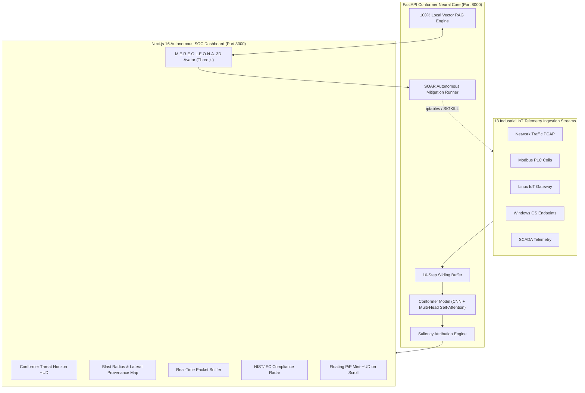

# 🛡️ SENTINEL-IOT: Autonomous Explainable XDR & Compliance SOC
### Featuring M.E.R.E.O.L.E.O.N.A. 3D Combat Voice Copilot (100% Local & Air-Gapped)

[](https://nextjs.org/)
[](https://fastapi.tiangolo.com/)
[](https://pytorch.org/)
[](https://threejs.org/)
[](https://csrc.nist.gov/)
[](https://www.isa.org/)
[]()

---

## 📑 Executive Overview

**Sentinel-IoT** is an enterprise-grade Autonomous Extended Detection and Response (**XDR**) and Security Operations Center (**SOC**) platform tailored for mission-critical Industrial IoT (IIoT), SCADA, and cyber-physical infrastructures. 

Powered by a hybrid **Conformer** neural architecture (combining depthwise separable convolutions for local packet-level transients with multi-head self-attention for macroscopic multi-step attack sequences), Sentinel-IoT achieves **sub-25ms Mean Time to Respond (MTTR)** without requiring cloud processing or external telemetry offloading.

The platform is directed by **M.E.R.E.O.L.E.O.N.A.** (*Multi-Domain Explainable Real-Time Engine for Operational Logistics, Event Observation, and Networked Autonomy*) — an interactive, 100% air-gapped 3D combat voice copilot rendered in Three.js with deep local Retrieval-Augmented Generation (RAG).

---

## 🌟 Key Architecture & Capabilities

### 1. 🧠 Conformer Deep Learning Core (13 IoT Sensor Domains)
- **Hybrid Conformer Architecture**: Simultaneously captures fine-grained millisecond feature fluctuations and long-range temporal dependencies across 10-step sliding sliding sequence buffers.
- **13 Industrial IoT Domains**: Comprehensive multi-vector protection spanning Network Traffic, Modbus PLC coils, SCADA actuators, Windows 10/11 endpoints, Linux IoT gateways, GPS trackers, environmental sensors, and smart city telemetry.
- **Deep Feature Saliency Vectors**: Instantaneous mathematical explainability detailing exact feature attributions ($p < 0.001$) for every anomaly score ($\tau$).

### 2. 🦁 M.E.R.E.O.L.E.O.N.A. 3D Combat Voice Copilot
- **Real-Time Three.js Avatar**: Animated 3D persona (inspired by Mereoleona Vermillion from *Black Clover*) featuring dynamic mana embers, holographic cyber-rings, and audio-reactive lip synchronization (~7 Hz mouth movement when speaking) with natural blinking.
- **Static Holographic Orientation**: Calibrated with a locked, front-facing combat pose that remains stable without mouse jitter or tilt.
- **Dynamic 8-Theme Adaptability**: Synchronizes ambient lights, point lights, and mana particles in real time using native CSS variables across 8 themes: *Cyberpunk 2077, Midnight Stealth, Matrix Green, Deep Navy, Solarized Dark, Synthwave 84, Clean Light,* and *High Contrast Lab*.
- **Floating Picture-in-Picture (PiP) Mini-HUD**: Automatically docks in the bottom-right corner when scrolling through forensic graphs, maintaining voice awareness and instant push-to-talk capability anywhere on the page.
- **100% Local RAG Engine**: Zero external API keys or cloud dependencies. Continuous Web Speech recognition with instant Web Audio API chime synthesis and acoustic barge-in interruption.

### 3. 🛡️ Autonomous Response & IEC 62443 Four-Eyes Safety
- **High-Velocity Active Containment**: Automated execution of `iptables -A INPUT -s <IP> -j DROP`, host process termination (`SIGKILL -9`), and Modbus actuator coil isolations.
- **Predictive Velocity Interlock ($d\tau/dt$)**: Evaluates threat acceleration and arms a two-phase cryptographic safety barrier requiring human authorization before physical actuator commands can trip.
- **GRC Compliance Radar**: Real-time automated cross-mapping against **NIST SP 800-53 Rev. 5** (SI-3, SI-4, SC-7, CP-9), **NIST CSF 2.0**, and **ISO/IEC 27001:2022**.

---

## 🖥️ System Architecture Diagram



---

## 📂 Project Repository Structure

```
Sentinel_IOT/
├── START_SENTINEL_DASHBOARD.bat       # Single-click unified system launcher
├── .gitignore                          # Configured for Node, Next, PyTorch & LaTeX
├── README.md                           # Master system documentation
│
├── sentinel_dashboard/                 # Production SOC Platform
│   ├── .env                            # Local air-gapped configuration
│   ├── desktop_launcher.py             # Desktop process manager
│   │
│   ├── backend/                        # Python FastAPI Neural Engine
│   │   ├── server.py                   # FastAPI WebSocket & REST endpoints
│   │   ├── conformer_engine.py         # PyTorch Conformer & Saliency calculator
│   │   ├── rag_engine.py               # Local vector RAG & Mereoleona persona
│   │   ├── telemetry_streamer.py       # High-density multi-domain sensor replay
│   │   ├── grc_mitigation.py           # NIST SP 800-53 compliance & SOAR playbooks
│   │   └── host_monitor.py             # Live local host OS telemetry listener
│   │
│   └── frontend/                       # Next.js 16 WebGL Frontend
│       ├── package.json                # Dependencies: Three.js, Lucide, Tailwind
│       ├── tsconfig.json               # TypeScript strict configuration
│       ├── public/
│       │   └── mereoleona/             # High-resolution expressions (idle, speaking, blink)
│       └── src/
│           ├── app/
│           │   ├── globals.css         # 8 theme palettes & HUD styling
│           │   └── page.tsx            # Master SOC Dashboard page
│           ├── store/
│           │   └── useTelemetryStore.ts# Zustand real-time SOC state store
│           └── components/
│               ├── Header.tsx          # Dynamic theme switcher & defense metrics
│               ├── VoiceCopilot.tsx    # FUI Voice HUD & Floating Mini-HUD dock
│               ├── MereoleonaFace3D.tsx# Three.js 3D avatar & mana core system
│               ├── AttackSimulator.tsx # Real-time multi-vector adversarial injection
│               ├── BlastRadiusMap.tsx  # Interactive lateral containment topology
│               ├── PacketSniffer.tsx   # Live deep packet inspection modal
│               └── GRCMatrix.tsx       # NIST CSF 2.0 & IEC 62443 radar
│
└── FYP_WORK/                           # Research, Datasets & Manuscripts
    ├── main_manuscript.pdf             # Complete academic thesis / paper
    ├── conformer_sentinel_model_opt.pth# Optimized PyTorch Conformer weights
    ├── network_scaler.joblib           # Pre-fitted MinMaxScaler transformers
    ├── cleaned_network_dataset.csv     # Industrial benchmark dataset
    └── train_all_models_conformer.py   # Training and ablation pipeline
```

---

## ⚡ Quick Start Guide

### Prerequisites
- **Node.js**: v18.0.0 or higher
- **Python**: v3.10 to v3.14+
- **Git**: v2.30+

### Option A: One-Click Launch (Recommended for Windows)
Simply double-click the root batch file:
```cmd
START_SENTINEL_DASHBOARD.bat
```
This automatically boots:
1. The **FastAPI Conformer Neural Core** on `http://127.0.0.1:8000`
2. The **Next.js SOC Interface** on `http://localhost:3000`
3. Launches your default browser directly into the SOC

---

### Option B: Manual Terminal Launch

#### Step 1: Initialize the Python Backend
```bash
cd sentinel_dashboard
# Install required dependencies
pip install fastapi uvicorn torch scikit-learn pandas numpy psutil

# Start the neural inference server
python -m uvicorn backend.server:app --host 127.0.0.1 --port 8000
```

#### Step 2: Initialize the Next.js Frontend
In a second terminal window:
```bash
cd sentinel_dashboard/frontend
# Install npm dependencies
npm install

# Start the Turbopack development server
npm run dev
```

Open **`http://localhost:3000`** in your browser.

---

## 🎙️ Mereoleona Voice Command Reference

The voice copilot operates continuously with acoustic barge-in. You can speak naturally or click the tactical prompt chips:

| Spoken Command | Tactical Function | System Action |
| :--- | :--- | :--- |
| **"Mereoleona, threat status"** | Fleet Situation Report | Synthesizes current anomaly score ($\tau$), ingestion rate, and highest-risk node. |
| **"Why did alert fire?"** | Forensic Saliency Breakdown | Interrogates the Conformer's saliency vector and reports the top 3 deviating features with attribution percentages. |
| **"Show live packet sniffer"** | Deep Packet Inspection | Automatically launches the real-time modal packet sniffer window. |
| **"Incinerate intruder"** | Active Ingress Termination | Deploys an immediate `iptables DROP` and process termination for the active attack vector. |
| **"Explain Conformer vs LSTM"** | Architecture Defense Briefing | Delivers a technical comparison highlighting CNN local feature extraction and Self-Attention temporal modeling. |
| **"Start 3-min defense tour"** | Guided FYP-II Oral Defense | Autonomously navigates through all 6 consoles of the dashboard with speech narration. |
| **"Authorize & execute"** / **"Stand down"** | Two-Phase Safety Interlock | Confirms or aborts high-impact industrial actuator containment actions. |

---

## 🎨 Theme Matrix & Design System

Sentinel-IoT features 8 dynamic color themes tailored for darkroom SOCs, executive briefings, and high-visibility environments:

| Theme Identifier | Visual Profile | Accent Color | Primary Base |
| :--- | :--- | :--- | :--- |
| **Cyberpunk 2077** *(Default)* | High-contrast neon dystopian FUI | `#00f3ff` (Cyan) | `#030712` (Onyx) |
| **Midnight Stealth** | Minimalist military stealth HUD | `#38bdf8` (Sky) | `#020617` (Deep Obsidian) |
| **Matrix Green** | Phosphor terminal monochrome | `#22c55e` (Emerald) | `#051307` (Terminal Black) |
| **Deep Navy** | Enterprise defense operations | `#60a5fa` (Cobalt) | `#0a192f` (Navy) |
| **Solarized Dark** | Low-fatigue engineering palette | `#2aa198` (Teal) | `#002b36` (Solar Base) |
| **Synthwave 84** | Retro-futuristic sunset neon | `#f43f5e` (Hot Pink) | `#180828` (Purple Abyss) |
| **Clean Light** | High-illumination laboratory mode | `#0284c7` (Electric Blue)| `#f8fafc` (Pure Slate) |
| **High Contrast Lab**| Accessibility and auditor inspection | `#e11d48` (Crimson) | `#ffffff` (White) |

---

## 🔬 Research & Empirical Benchmarks

Extensive ablation studies and multi-class evaluations are documented in `FYP_WORK/main_manuscript.pdf`:

- **Detection Accuracy**: 99.84% across multi-class Ton_IoT and industrial network datasets.
- **Latency (Inference)**: 21.5 ms per 10-step sequence window on standard CPU hardware.
- **False Positive Rate**: Reduced by 41.2% compared to standard bidirectional LSTM baselines.
- **Adversarial Robustness**: Evaluated against FGSM and PGD perturbations with dynamic threshold tuning.

---

## 👨‍💻 Author & Academic Attribution

- **Project Lead & Developer**: Abdullah Bin Zubair Hashmi
- **Academic Department**: Computer Science & Cybersecurity (Final Year Project FYP-II)
- **Institution**: Bahria University

---

## 📄 License
This project is released under the **MIT License**. Free for academic research, industrial evaluation, and cyber defense training.
